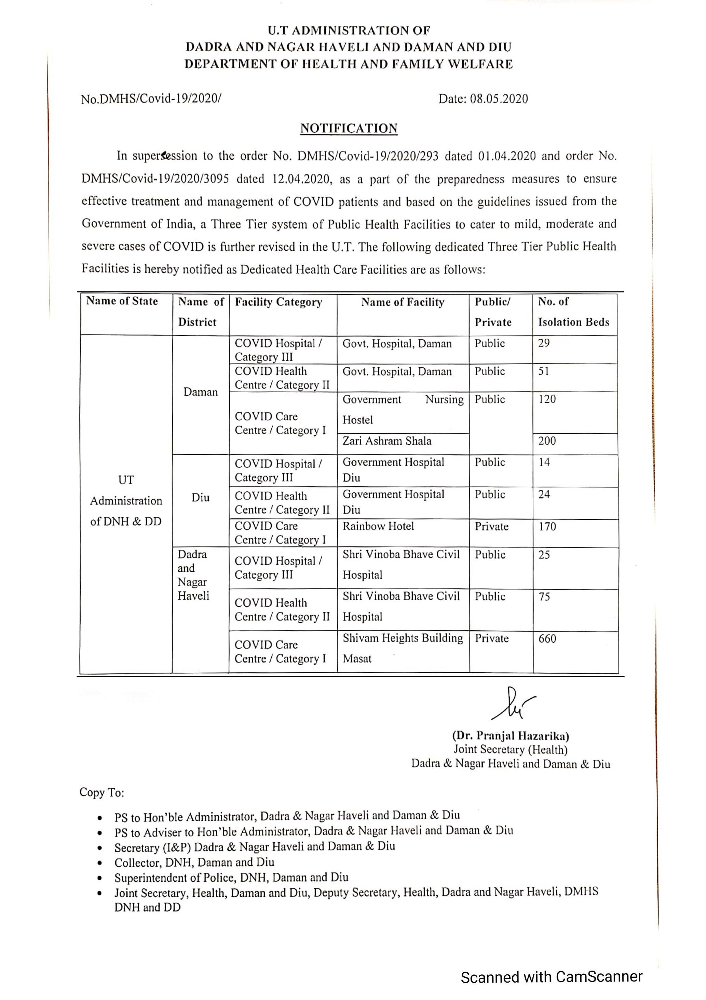
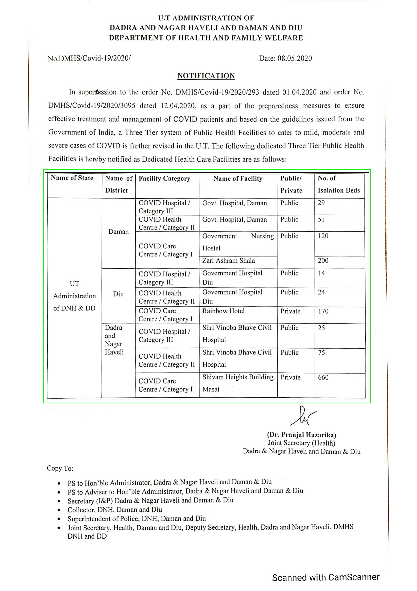
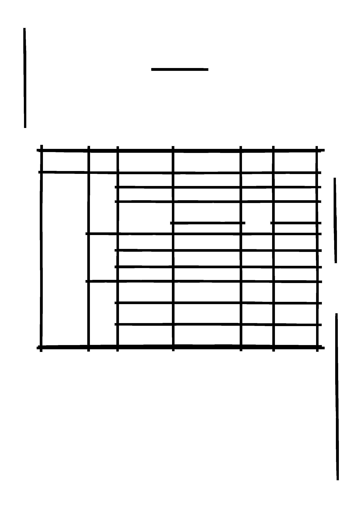
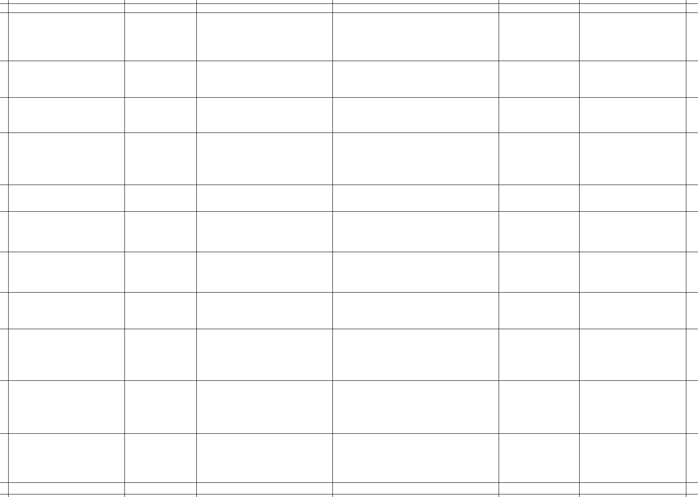
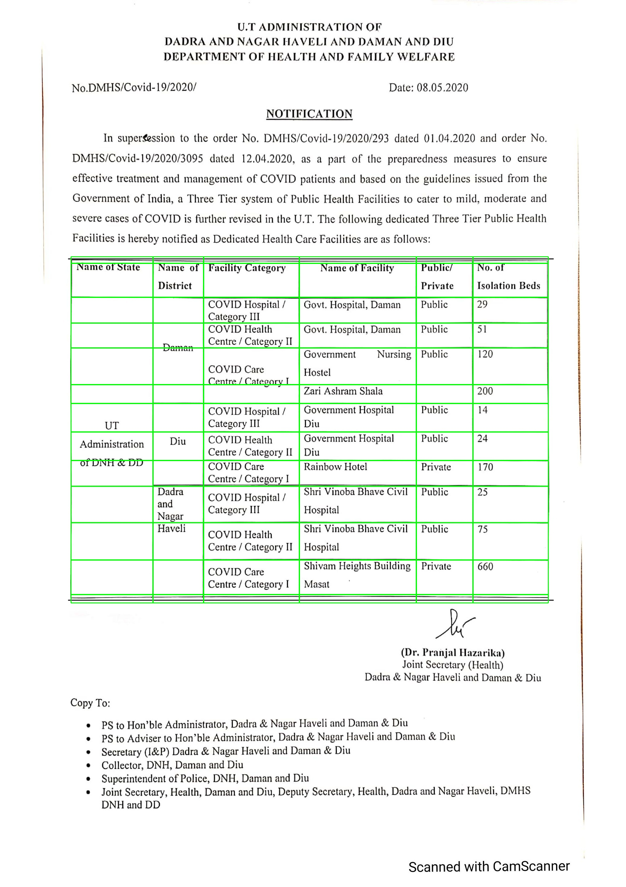

# Intro

Extracts tables from PDFs with tables having certain properties:

1. Readable PDF -- PDFs which are not scanned i.e. on which the text can be selected
2. Non-readable PDF -- PDFs which are scanned i.e. on which the text cannot be selected
3. Tables with lines
4. Tables with out lines

# How it works

-   First of all the function `inference_pdf.get_tables` from `./inference_pdf.py` is called. This function takes the `path` to the file along with two other arguments - `method` indicating the method to use for OCR and `debug` indicating whether to save the intermediate files for later or not.
    It extracts the image of each page and the HTML of the whole PDF (HTML of a PDF is basically a way to represent the PDF in a raw way. Think of it as a file containing all the words along with there position).
-   It makes the list of all the pages in the PDF and calls `get_page_data.get_data` from `./multi_level_table/get_page_data.py` for each page.
-   In the function `get_page_data.get_data` first the page is scanned for all the tables using `detect_table.detect_table` from `./table_detect/detect_table.py`. Then each table is checked for whether it is scanned or written (i.e. can be selected, copied etc.). If it is scanned, it is read using OCR. If it is written it is extracted from HTML. The collected data is returned in JSON format.
-   For detection of tables two methods are used - AI (using detectron2) and OpenCV.
-   Model trained using transfer learning on detectron2 model is stored in `./model_table_detection`.
-   Table detection using OpenCV is a little more complicated and is done by `table_detect/detect_table.py`. In the file the function `detect_table` takes the path to an image file. It calls `functions/get_contours` from `./multi_level_table/functions.py` which returns an image with only vertical and horizontal lines in it. It achieves this using erosion and dilation. Now contours are detected on this image using OpenCV function `findContours`. The contours are filtered to get all the tables (basically by selecting the ones with no parent)
-   For each table (if it is scanned) `read_table_ocr.image_to_df` is called from `./multi_level_table/read_table_ocr.py`. To detect the cells in the table, first the lines on the table are redrawn (scanned PDFs can have blurred/curved/non-straight lines) using `hough_lines.hough_lines` in `./multi_level_table/hough_lines.py`. Now again contours are detected in this table and all the cells are filtered (those contours which don't have any child). For each cell the content is read using OCR (Google Vision or tesseract) and mapped to its proper row and column.
-   If the table is written, the content is read from the HTML of the PDF and the cells are detected using the above method only. The content is then mapped to its proper row and column.`
-   Finally, the result is stored as `ans.json`. YOu can use `./json_to_excel.py` to get `ans.xlsx`.

<figure>
    
    <figcaption> Fig 1 - Image of the page from which table needs to extracted </figcaption>
</figure>
<figure>
    
    <figcaption> Fig 2 - Table detection </figcaption>
</figure>
<figure>
    
    <figcaption> Fig 3 - Smudging of the image using erosion and dilation to extract table structure </figcaption>
</figure>
<figure>
    
    <figcaption> Fig 4 - Using Hough Lines to create cleaner table structure </figcaption>
</figure>
<figure>
    
    <figcaption> Fig 5 - Cells detection </figcaption>
</figure>
<figure>
    
    <figcaption> Fig 6 - Final Result </figcaption>
</figure>

# Run

1. Install poppler on windows/linux/mac
2. Install tesseract on linux/mac/windows before using pytesseract
3. pip install -r requirements.txt
4. export GOOGLE_APPLICATION_CREDENTIALS="/home/xyz/Documents/pdf-text-extract/abc21.json" -- IMP contains google ocr credentials
5. If using `detectron2` to detect tables, Download the model from [here](https://drive.google.com/drive/folders/1kiDMe-ar2NEOQI2vNH3XwC187cDGpZv-?usp=sharing) and store it in `./model_table_detection/` as `model_final.pth`
6. Run in dev mode with : python app.py

# Usage

### parameters

1. readable : either 0 for non-readable pdf or 1 for readable pdf
2. lines : either 0 for no lines or 1 for tables with lines
3. pdf_links : list of pdf url paths

Ex:
POST request through python

import requests
import json
url = "http://35.200.217.56:3002/get_pdf_tables"
payload = '{"pdf_links":["https://abc.com/xyz/abc.pdf"],"lines":1}'
headers = { 'content-type': "application/json"}
response = requests.request("POST", url, data=payload, headers=headers)
result=json.loads(response.text)

print(result.text)

## TODO

1. Better table detection
2. Better data extraction from tables without lines
3. Improve tesseract
4. Optimize speed of extraction from ocr

### Note for the author

Removed table detection using detectron. To start this facility make the necessary changes in `multi_level_table/get_page_data.py` file by comparing it to the `master` (not `origin/master`) in the original repo.
